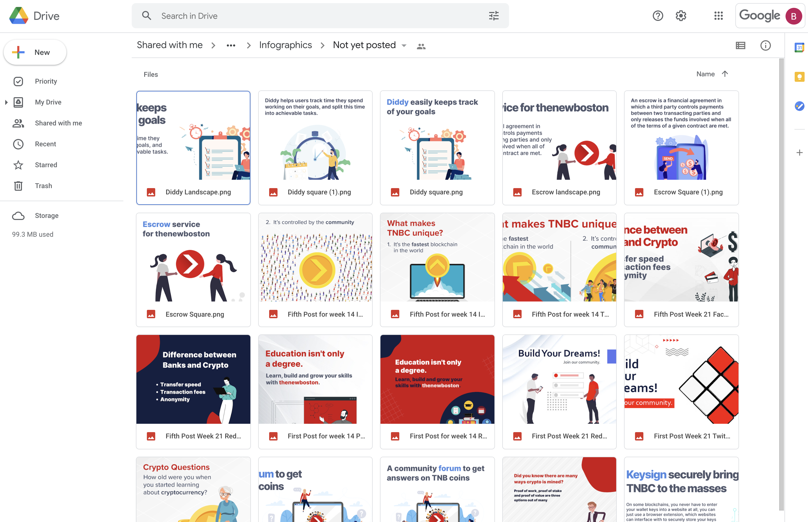

## Bounty Payments

When a user submits content for a bounty that we would like to accept, save the file (typically a graphic) in our 
Google Drive folder under `Marketing/Content/Infographics/Not yet posted`.

<p align="center">
  
</p>

```
@Chrisha1212 Payment Due

---

User: 
Amount: 

```
