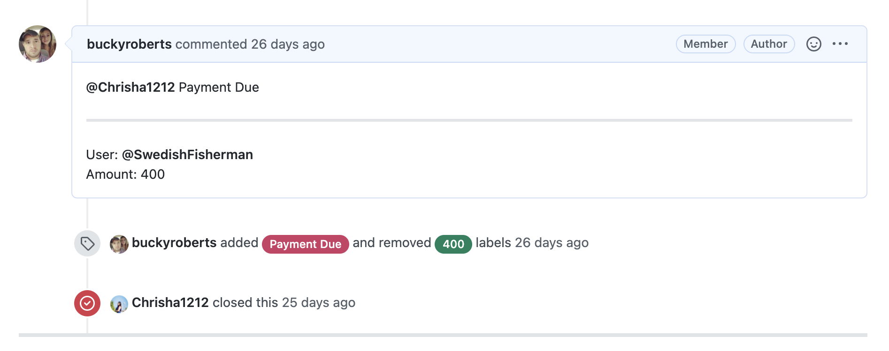

# Bounty Payments

This guide will explain the bounty payment system for the marketing team.

## Accepting Bounties

When a user submits content for a bounty that we would like to accept, save the file (typically a graphic) in our 
Google Drive folder under `Marketing/Content/Infographics/Not yet posted`.

<p align="center">
  
</p>

## Flagging for Payment Due

On the GitHub issue, copy the code below and paste in as a new comment. Fill out the user (which will also notify them) 
along with the amount owed.

```
@Chrisha1212 Payment Due

---

User: 
Amount: 

```

You can then add the `Payment Due` label. 

<p align="center">
  
</p>

Chrisha will send that user the coins and then close the issue.
